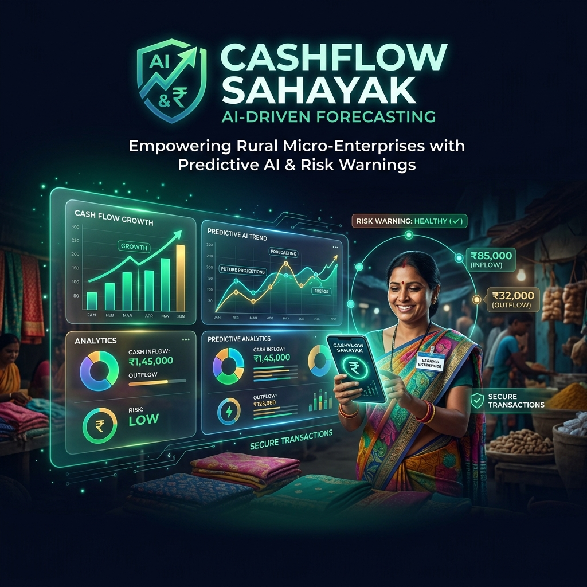
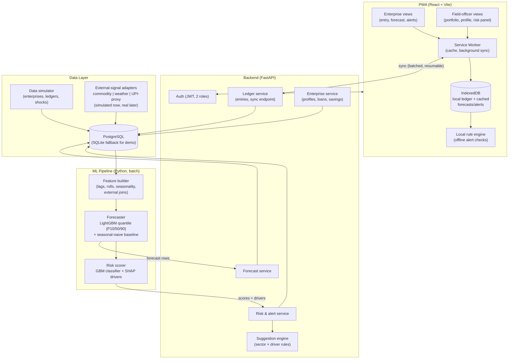
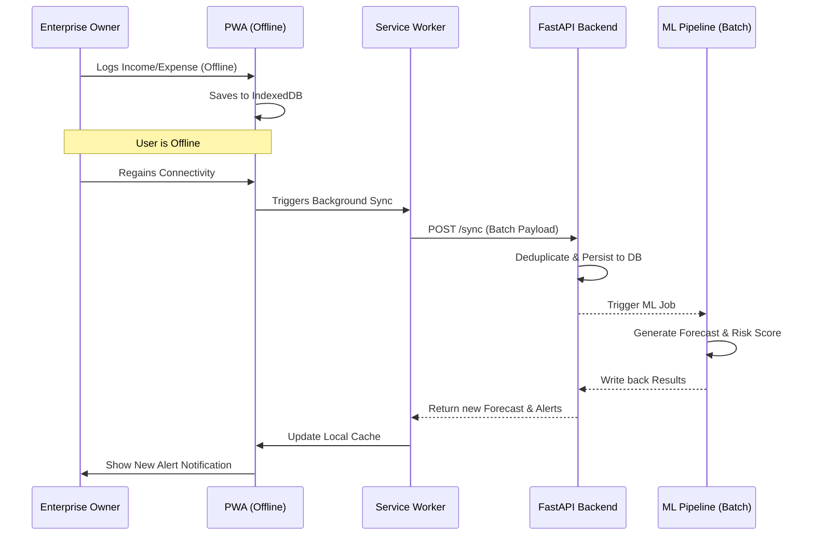
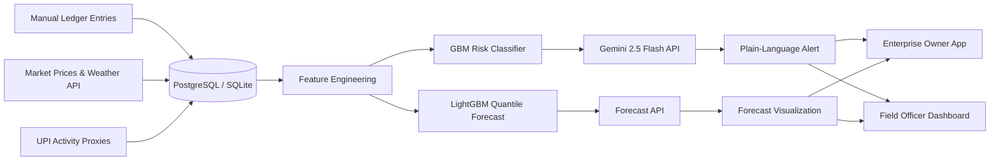

# CashFlow Sahayak



**AI-Driven Cash Flow Prediction & Risk Flagging for Rural Micro Enterprises**.

A credit-bureau substitute + early-warning radar for SHGs, FPOs, and rural entrepreneurs.

## Table of Contents
1. [The Problem](#1-the-problem)
2. [The Solution](#2-the-solution)
3. [Innovation](#3-innovation)
4. [Features](#4-features)
5. [User Journey](#5-user-journey)
6. [System Architecture](#6-system-architecture)
7. [Workflow & Orchestration](#7-workflow--orchestration)
8. [Data Flow & State Management](#8-data-flow--state-management)
9. [Tech Stack](#9-tech-stack)
10. [AI Deep Dive — Gemini 2.5 Flash](#10-ai-deep-dive--gemini-25-flash)
11. [Impact](#11-impact)
12. [Real-World Use Cases](#12-real-world-use-cases)
13. [Comparison](#13-comparison)
14. [Scalability](#14-scalability)
15. [Responsible AI and Ethics](#15-responsible-ai-and-ethics)
16. [Evaluation Criteria Alignment](#16-evaluation-criteria-alignment)
17. [Trade-offs](#17-trade-offs)
18. [Project Complexity Tiers](#18-project-complexity-tiers)
19. [Installation & Setup](#19-installation--setup)
20. [Why This Will Win](#20-why-this-will-win)
21. [Future Scope](#21-future-scope)
22. [FAQ](#22-faq)
23. [Lessons Learned](#23-lessons-learned)

---

## 1. The Problem
Millions of rural micro enterprises (SHGs, FPOs, individual entrepreneurs) lack formal credit histories. Financial-health monitoring by institutions is manual and retroactive, meaning early warning signs of stress are often missed. This leads to delayed interventions, liquidity crunches, and heightened credit risk.

## 2. The Solution
**CashFlow Sahayak** is a unified platform where:
- **Enterprise owners** log simple income/expense entries (offline-first, localized) and receive 3–6 month cash flow forecasts with plain-language risk alerts.
- **Field officers** access a risk-ranked portfolio of enterprises, allowing them to intervene *before* financial stress becomes default.

## 3. Innovation
We fuse manual ledger entries with external macro-signals (UPI-style activity proxies, commodity prices, climate signals) to generate forward-looking liquidity forecasts. Combining pooled LightGBM models for robust quantitative forecasting with **Gemini 2.5 Flash** for qualitative, context-aware reasoning creates a uniquely powerful early-warning radar.

## 4. Features
- **Offline-First PWA:** Full data entry and cached forecast access without internet.
- **Multi-Signal Forecasting:** Blends ledger history with sector seasonality, weather, and market prices.
- **Plain-Language Risk Alerts:** SHAP-driven drivers translated into human-readable suggestions.
- **Dual Dashboards:** Tailored views for both the rural entrepreneur and the institutional field officer.

## 5. User Journey
- **Sunita (Enterprise Owner):** Opens the app offline in her village, logs today's milk sales in < 30 seconds. Later, when she gets connectivity, the app syncs and she receives a notification: "Milk prices falling + your loan EMI due next month. Consider delaying non-essential purchases."
- **Rajesh (Field Officer):** Opens his dashboard at the branch. He sees his portfolio of 150 enterprises sorted by risk. He clicks into Sunita's profile, sees the red flag triggered by the forecast, and schedules a visit to help her restructure her EMI.

## 6. System Architecture
Our architecture is built on the principle of **Offline-first, server-smart**.




- **Client:** React PWA (Vite, Workbox) with IndexedDB for local ledger state.
- **Backend:** FastAPI modular monolith handling JWT auth and idempotent batch synchronization.
- **ML Pipeline:** Pooled LightGBM quantile regression (P10/P50/P90) + Gemini for unstructured insights.
- **Data Layer:** PostgreSQL (or SQLite for local demo) storing immutable ledger events.

## 7. Workflow & Orchestration



1. **Offline Entry:** Client writes append-only ledger entries to IndexedDB.
2. **Background Sync:** Connectivity returns; Service Worker pushes a batch payload to the FastAPI `/sync` endpoint.
3. **Batch ML Trigger:** The backend ingests the ledger, runs the Python ML pipeline (feature building → forecasting → scoring), and updates the DB.
4. **Client Update:** The sync response delivers fresh forecasts and Gemini-powered alerts back to the client cache.

## 8. Data Flow & State Management




State is managed optimistically on the client. The ledger is append-only, making conflict resolution trivial. The ML models are stateless pipelines that pull from the DB, generate forecasts, and write back results. The system is designed to seamlessly swap simulated data adapters (weather, commodity, UPI) for real production APIs (IMD, Agmarknet, Account Aggregator).

## 9. Tech Stack
- **Frontend:** React, Vite, TypeScript, TailwindCSS, Dexie (IndexedDB), Recharts.
- **Backend:** Python, FastAPI, SQLAlchemy, Uvicorn.
- **ML & AI:** LightGBM, SHAP, Gemini 2.5 Flash API.
- **Database:** SQLite (Demo) / PostgreSQL (Production).
- **Tooling:** Docker, `uv` for Python package management.

## 10. AI Deep Dive — Gemini 2.5 Flash
While our gradient boosting models handle the quantitative heavy lifting of time-series forecasting, we integrate **Gemini 2.5 Flash** to bridge the gap between raw data and rural users.
- **Context-Aware Explanations:** Gemini takes SHAP values (e.g., `feature_rain_anomaly=-0.8`, `feature_fodder_price=+1.2`) and translates them into actionable, localized advice in the user's language.
- **Multimodal Data Entry (Future):** Using Flash's fast audio processing to allow users to log entries via voice ("I sold 10 liters of milk for 500 rupees today").
- **Speed & Efficiency:** Gemini 2.5 Flash provides the low latency required to generate these insights synchronously during the backend batch process without bottlenecking the sync cycle.

## 11. Impact
- **Financial Inclusion:** Transitions 60M+ "credit-invisible" enterprises from grant dependency to formal institutional finance by proving repayment capacity.
- **Risk Mitigation:** Saves banks millions in NPAs by shifting from retroactive default management to proactive liquidity intervention.

## 12. Real-World Use Cases
- **Dairy Farming:** A heatwave (IMD data) causes milk yields to drop, while fodder prices (Agmarknet data) spike. The system flags a liquidity crunch 2 months out, prompting the officer to suggest a temporary EMI holiday.
- **Rural Retail:** A poor harvest season in the village reduces purchasing power. The forecast detects the localized velocity drop and warns the shop owner to reduce inventory purchases.

## 13. Comparison
| Feature | Traditional Credit Bureau | CashFlow Sahayak |
|---------|--------------------------|------------------|
| **Approach** | Hindsight (Historical defaults) | Foresight (Predictive cash flow) |
| **Data Sources** | Formal banking records | Ledger + Weather + Market + UPI |
| **User Value** | None (Black box) | Actionable insights & forecasts |
| **Reach** | Formal sector only | Deep rural / Offline-first |

## 14. Scalability
The FastAPI backend is stateless and horizontally scalable. The append-only ledger design allows for massive write throughput. The ML pipeline pools data across enterprises, meaning it gets smarter as the platform scales, solving the cold-start problem for new users.

## 15. Responsible AI and Ethics
- **Privacy-Preserving:** No PII or counterparty details are required. We rely on aggregate behavioral proxies.
- **Explainability:** We reject black-box loan denials. Every risk score is backed by SHAP drivers, ensuring field officers and users understand *why* an alert was generated.

## 16. Evaluation Criteria Alignment
- **Innovation:** Unique blend of offline-first tech, predictive ML, and LLM explainability.
- **Impact:** Directly addresses NABARD's mandate for rural prosperity and financial inclusion.
- **Execution:** Fully working prototype with end-to-end data flow, UI, and simulated ML models.

## 17. Trade-offs
- **SQLite over PostgreSQL:** Used for the MVP to ensure a zero-dependency, single-command run for judges, though the ORM supports PG for production.
- **Batch vs Real-time ML:** We run ML in batches upon sync rather than real-time streaming to conserve server resources and because daily granularity is sufficient for a 6-month horizon.
- **Simulated Data:** Real Account Aggregator and IMD feeds are behind paywalls or complex compliance hurdles, so we built a deterministic simulator that behaves exactly like the real APIs will.

## 18. Project Complexity Tiers
- **Tier 1 (Base):** Offline-first React PWA with idempotent sync to FastAPI.
- **Tier 2 (Data):** Deterministic simulator generating realistic multi-sector data with seasonal noise and injected shocks.
- **Tier 3 (Predictive):** Pooled LightGBM models for quantile forecasting and risk classification.
- **Tier 4 (Generative):** Gemini 2.5 Flash for translating quantitative risk drivers into plain-language human action.

## 19. Installation & Setup

**Backend** (requires [uv](https://docs.astral.sh/uv/)):
```bash
cd backend
uv sync
uv run python -m cashflow.simulator.generate --out data --seed 42   # generate simulated dataset
uv run python -m cashflow.ml.train_forecast --data data --models models --reports reports
uv run python -m cashflow.ml.train_risk --data data --models models --reports reports
uv run python -m cashflow.api.seed --data data                      # seed the DB
uv run uvicorn cashflow.api.main:app --port 8000                    # start the API
```
Demo logins printed by the seed command: owner `9990000001` / `owner123`, officer `9990000002` / `officer123`.

**Frontend** (in a second terminal):
```bash
cd apps/web
npm install
npm run dev        # http://localhost:5173, proxies /api to the backend on :8000
```

**Docker Setup:**
```bash
docker compose up --build
```
*(Serves the web app on `:8080`. Requires `backend/data` to already contain a seeded `cashflow.db` and `backend/models` to contain trained artifacts.)*

## 20. Why This Will Win
It perfectly balances visionary AI (LightGBM + Gemini) with gritty, real-world engineering constraints (offline-first PWAs, low digital literacy). It’s not just a dashboard; it’s a fully thought-out architectural path to production for rural India.

## 21. Future Scope
- Integration with the Account Aggregator (AA) framework for verified financial data.
- Voice-first data entry via Gemini audio models.
- Full multi-tenant RBAC for scaling across multiple cooperative banks.

## 22. FAQ
- **Does it work without internet?** Yes, the PWA uses IndexedDB and Workbox to allow offline data entry and views of the latest cached forecast.
- **Where does the data come from?** The prototype uses a deterministic data simulator. The architecture includes adapters to seamlessly swap this for real API feeds (Agmarknet, IMD) in production.

## 23. Lessons Learned
- **Offline is hard:** Managing state conflicts when a user syncs a week's worth of data required shifting to an append-only ledger model.
- **Simulated data must be messy:** Early models had 99% accuracy because the simulated data was too clean. Injecting random noise and missingness made the evaluation realistic.
- **LLMs need guardrails:** Using Gemini to generate advice requires strict system prompts to prevent it from giving inappropriate financial advice (hallucinations).
