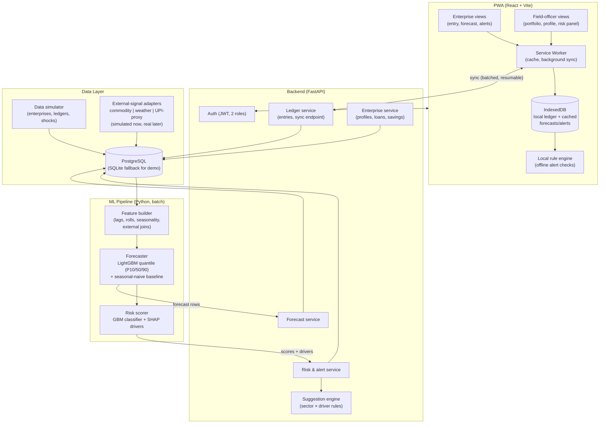

# Architecture — CashFlow Sahayak

Companion to [PRD.md](PRD.md) and [TRD.md](TRD.md).

## 1. Design Principles
1. **Offline-first, server-smart.** All heavy computation (forecasting, scoring) happens server-side on sync; the client caches results and runs only cheap rule checks locally. Rural connectivity is the constraint that shapes everything.
2. **Append-only ledger.** Financial entries are immutable events → sync/merge is trivial, audit is free, and feature engineering is reproducible.
3. **Global model + local signals.** One model trained across all enterprises (pooled), with enterprise-, sector-, region-level features — solves cold start and small-data-per-enterprise.
4. **Explainability is a feature, not an afterthought.** Every risk score carries its top drivers; the alert text is generated from those drivers.
5. **Adapters for real data later.** Simulated feeds sit behind the same interfaces a real UPI-aggregate / Agmarknet / IMD feed would use.

## 2. System Overview

## 3. Component Responsibilities

### 3.1 Client — single PWA, two role views
- **Stack:** React + Vite + TypeScript, Tailwind, Recharts for charts, `i18next` for EN/HI, Workbox for service worker.
- **Why PWA, not native:** installable on Android, offline via service worker, one codebase, demo-able on judges' phones via URL.
- **Offline behavior:** entries write to IndexedDB immediately (optimistic UI); background sync pushes when connectivity returns. Last-known forecast, score, alerts are cached and stamped "as of `<sync time>`". A small local rule engine re-evaluates static rules offline (e.g., "EMI due in 5 days and cached balance < EMI") so alerts stay live without a server.

### 3.2 Backend — FastAPI monolith (modular)
- **Why FastAPI monolith:** hackathon velocity; Pydantic models double as API docs; async is enough for demo scale. Modules are separated (`ledger`, `enterprise`, `forecast`, `risk`, `suggestions`) so any could be split into a service later.
- **Sync endpoint:** client sends batch of new entries with client-generated UUIDs + device timestamps; server dedupes by UUID (idempotent), returns any server-side updates (new forecast/score/alerts) in the same round-trip — one request per sync, cheap on bad networks.

### 3.3 ML pipeline — batch, not real-time
- Runs on a schedule (and on-demand after sync) as a Python job, not a separate service: `build features → forecast → score → write back`.
- **Forecaster:** pooled **LightGBM quantile regression** (3 models: P10/P50/P90) over monthly aggregates. Features: lagged net flows, rolling stats, entry-regularity, sector one-hots, sector seasonal index, commodity price level/momentum for the sector's key commodity, rainfall anomaly, months-to-festival-peak. **Baseline kept in repo:** seasonal-naive + sector curve — demoed as comparison and used as fallback for < 2 months history.
- **Risk scorer:** LightGBM classifier trained on simulator-generated stress labels (an enterprise is "stressed in month M" if simulated balance < obligations). SHAP values → top-3 drivers → template-based plain-language reasons. A **rule overlay** guarantees floor behavior (e.g., missed EMI ⇒ at most Amber regardless of model).
- **Why gradient boosting over deep/Prophet:** tabular multi-source features, tiny per-entity series, need for pooled learning + explainability + CPU-only training in minutes. Prophet/ARIMA can't ingest cross-sectional external signals cleanly; deep sequence models are unjustifiable at this data scale and timebox.

### 3.4 Data layer
- **PostgreSQL** (Docker) for the real deployment; **SQLite** switch for a zero-dependency judge-machine demo. SQLAlchemy keeps both working.
- **Simulator** is a first-class module (see TRD §4): generates 18–24 months of ledgers for ~50 enterprises across 5 sectors, with seasonality, noise, missingness, and injected shock scenarios (drought month, feed-price spike, demand collapse) — these shocks create the ground-truth stress labels the scorer trains on.
- **External-signal adapters:** `CommodityPriceSource`, `WeatherSource`, `UpiProxySource` interfaces with simulated implementations. Real ones later: Agmarknet/CEDA API, IMD/ERA5, NPCI aggregate stats or AA-framework consented data.

## 4. Data Flow (happy path)
1. Owner logs entries offline → IndexedDB.
2. Connectivity returns → service worker syncs batch → ledger service persists (idempotent).
3. Sync triggers (or nightly batch runs) the ML job for that enterprise → forecast rows + risk score + drivers written to DB.
4. Sync response / next poll delivers fresh forecast, score, alerts, suggestions → cached client-side.
5. Officer dashboard reads the same score/forecast tables, aggregated across the portfolio.

## 5. Security & Privacy (right-sized for prototype)
- JWT auth, two roles (`owner` scoped to own enterprise, `officer` scoped to assigned portfolio).
- No PII beyond name/village/sector; no bank account numbers, no counterparty data in UPI proxies (aggregate counts/volumes only) — by design, matching the constraint in the brief.
- HTTPS everywhere; entries signed with client UUIDs for idempotency, not identity.

## 6. Deployment
- **Demo:** single `docker-compose up` — `web` (static PWA via nginx), `api` (FastAPI + ML job), `db` (Postgres). Seed command loads the simulator output. Also runs fully local (SQLite + `npm run dev` + `uvicorn`) for offline judging.
- **Stretch:** free-tier cloud (Render/Railway/Fly) so the PWA is installable from a public URL during the pitch.

## 7. Path to Production (the "is this real?" answer)
| Prototype piece | Production replacement |
|---|---|
| Simulated UPI proxies | AA-framework consented pulls or NPCI aggregate district-level stats |
| Simulated commodity prices | Agmarknet / e-NAM APIs |
| Simulated weather | IMD gridded data / ERA5 |
| SQLite/Postgres single node | Managed Postgres + read replicas; partition ledger by enterprise |
| Batch ML on sync | Scheduled Airflow/Prefect pipeline; model registry (MLflow); champion/challenger |
| Two-role JWT | Full RBAC, org hierarchy (NABARD → bank → BC → enterprise), audit log |
| Template suggestions | Reviewed advisory content library, per-language, per-sector |
