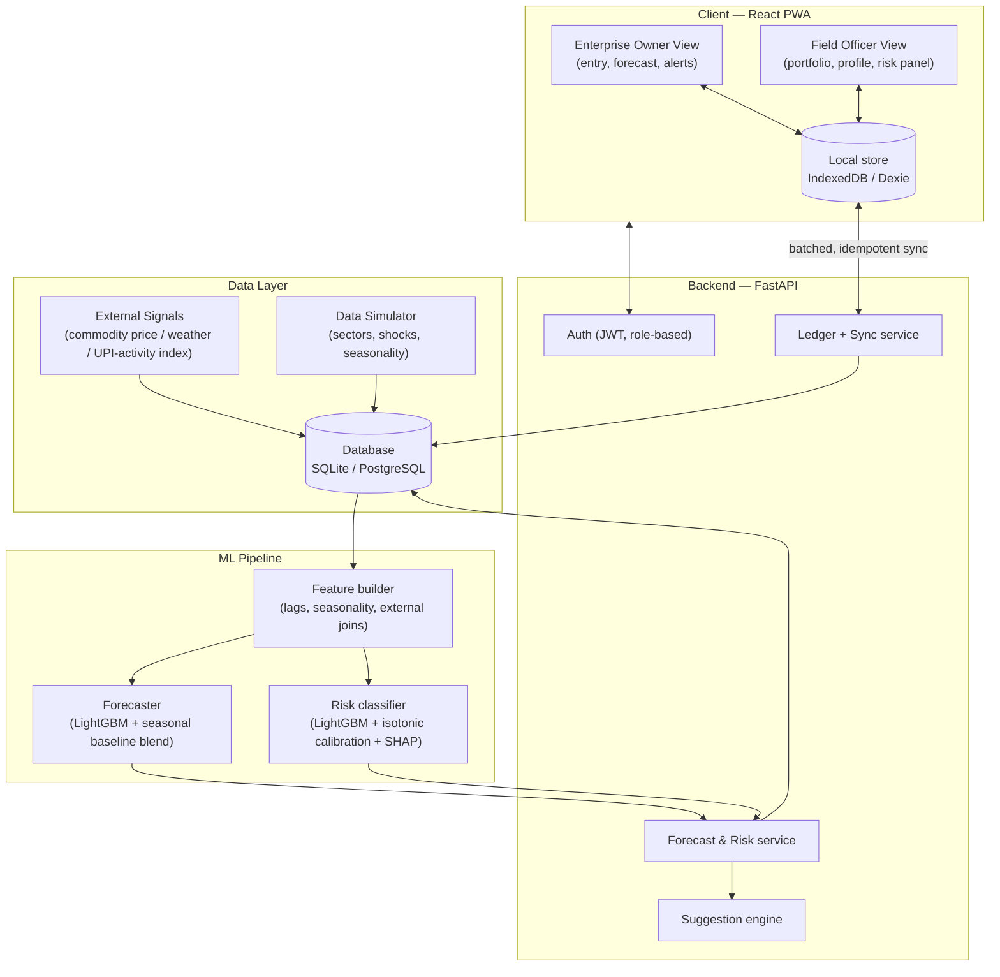

# Hackathon Submission — CashFlow Sahayak
### AI-Driven Cash Flow Prediction & Risk Flagging for Rural Micro Enterprises

---

## 1. Brief Description of the Idea

Millions of rural micro-enterprises — SHGs, FPOs, dairy and poultry farmers, food processors, artisans, and rural retailers — run productive, cash-generating businesses with **no formal credit history**. Banks and NABARD-affiliated institutions can't see their financial health until a crisis (a missed EMI, a collapsed harvest, a price shock) has already happened, because monitoring today is manual, periodic, and reactive.

**CashFlow Sahayak** is an AI-driven platform that turns a rural enterprise's own simple transaction records — combined with digital-payment activity trends, commodity prices, and weather/climate signals — into a **3–6 month cash-flow forecast** and a **live, explainable risk score**. It gives the enterprise owner early, plain-language warning of financial stress *before* it happens, with a concrete suggested action, and gives the field officer a risk-ranked view of their entire portfolio so interventions happen weeks earlier than they do today.

In one line: **it is a credit-bureau substitute and an early-warning radar for the 60M+ rural enterprises that formal finance currently cannot see.**

---

## 2. Proposed Solution

### What it does
- **For the enterprise owner:** a mobile-first, offline-capable app to log income, expenses, savings, and loan repayments in under 30 seconds; in return, they see a 6-month cash-flow forecast with a confidence band, a simple Green/Amber/Red risk status, and one concrete, sector-specific suggestion whenever risk rises (e.g. *"Fodder prices are rising — buy a month's stock now or switch part of the ration to silage"*).
- **For the field officer / bank BC:** a single dashboard showing every assigned enterprise ranked by risk, with drill-down into any profile's forecast, top risk drivers, and alert history — turning what is today a manual village-by-village check into a five-minute daily portfolio scan.

### How it works (the AI core)
1. **Multi-source data fusion.** The model combines the enterprise's own ledger (income/expense/savings/loan entries) with three external signal families:
   - **Digital transaction proxies** — aggregate, non-personal UPI-style activity indices (never counterparty-level data).
   - **Market intelligence** — commodity input/output price levels, momentum, and volatility for the enterprise's specific sector (fodder, feed, raw grain, handicraft export prices, wholesale/retail prices).
   - **Climate & seasonality** — rainfall anomaly, heat-stress index, monsoon phase, and festival/demand seasonality curves calibrated per sector.
2. **Forecasting engine** — a pooled machine-learning model (trained across all enterprises, not one-per-enterprise) predicts next month's net cash flow with an uncertainty band, blended against a strong seasonal baseline so it works even for a brand-new enterprise with only a few weeks of data (cold-start handled via sector-level priors).
3. **Early-warning risk engine** — a second model predicts the probability of financial stress in the next 1–3 months, calibrated so its score is a genuine probability, with a rule-based safety net (e.g., a missed EMI or a run of unlogged weeks automatically caps the score) that guarantees the system never quietly stays "safe" when a hard signal says otherwise.
4. **Explainability by design** — every risk score ships with its top 2–3 contributing factors in plain language (via SHAP feature attribution mapped to a human-readable driver taxonomy: liquidity shortfall, EMI pressure, commodity price shock, climate stress, seasonal dip, disengagement), and every Amber/Red flag is paired with a sector-specific, bilingual (English/Hindi) suggested action from a curated action library.
5. **Offline-first delivery** — because rural connectivity is intermittent, all data entry happens locally on-device and syncs in a single, resumable batch whenever a connection is available; the last-synced forecast and alerts remain visible offline.

### Differentiators
- **Sector-aware, not generic** — dairy, poultry, food processing, handicrafts, and rural retail each have distinct seasonality, price linkages, and risk playbooks built in, not a one-size-fits-all credit score.
- **Explainable, not a black box** — a field officer or NABARD auditor can see *why* an enterprise is flagged, which is essential for trust and for actual intervention.
- **Built for the network reality of rural India** — offline-first is a first-class design constraint, not an afterthought.
- **Privacy-respecting by construction** — no sensitive personal data or counterparty-level transaction data is used; digital-payment signals are aggregate activity indices only.

---

## 3. Business Model / Commercial Potential

### Who pays, and why
| Customer segment | Value delivered | Monetisation |
|---|---|---|
| **NABARD / RRBs / Cooperative banks** | Better credit appraisal data on currently credit-invisible borrowers → higher-quality lending decisions, lower NPAs, faster disbursal | Platform licensing / SaaS subscription per institution, or per-district deployment fee |
| **Banking Correspondents / MFIs / FPOs** | A portfolio-monitoring tool that replaces manual village visits with a prioritized digital worklist | Per-officer-seat subscription, or bundled into existing BC technology contracts |
| **Enterprise owners** | Free-to-use forecasting and advisory tool that also builds a credit-worthiness track record over time | Free at point of use (cost absorbed by the institutional side — mirrors how credit bureaus/CIBIL are funded by lenders, not consumers) |
| **Government / development agencies** | A ready-made digital public good for last-mile financial inclusion monitoring, usable for scheme targeting and impact measurement | Grant-funded pilot → institutional licensing at scale |

### Revenue model options
1. **B2B SaaS licensing** to NABARD-affiliated banks/RRBs/cooperatives — priced per enterprise profile under monitoring or per district/branch.
2. **Value-added data/analytics layer** for institutions that want portfolio-level dashboards, sector risk heatmaps, and early-warning alert feeds for their own credit risk teams (a premium tier on top of the free enterprise-facing app).
3. **Ecosystem partnerships** — commodity price and weather data providers, agri-input companies, and insurance providers could co-fund or integrate (e.g. parametric weather insurance triggered by the same climate signals already computed).
4. **Grant-to-credit bridge fee** — a small facilitation fee when a beneficiary's improved forecast/risk profile is used to unlock formal credit that graduates them off a grant-based scheme, aligned with NABARD's own stated value-creation goal.

### Market size and scaling logic
India has an estimated 60+ million unbanked or under-banked rural micro-enterprises. Even a modest institutional foothold — a few hundred RRB branches or BC networks — represents tens of thousands of enterprise profiles, and the marginal cost per additional enterprise is near-zero once the pooled model and data pipelines are built (the architecture is explicitly designed to scale as a shared model + per-enterprise features, not per-enterprise custom modelling).

### Commercial moat
- **Data network effect:** every additional enterprise onboarded improves the pooled forecasting/risk model for everyone (especially for cold-start enterprises, which borrow strength from sector-level patterns).
- **Switching cost for institutions:** once a bank's field officers build their daily workflow around the risk-ranked portfolio dashboard and an enterprise has an accumulating track record, both sides have strong incentive to stay.
- **Regulatory/trust alignment:** privacy-by-design (no PII beyond name/village, no counterparty-level UPI data) matches the direction of India's data protection and Account Aggregator regulatory framework, unlike scraping-based alternatives.

---

## 4. Technology Stack Details

| Layer | Technology | Why |
|---|---|---|
| **Frontend (client)** | React 18 + TypeScript + Vite, Tailwind-style inline styling, Recharts (forecast charts), react-router, i18next (English/Hindi), Dexie (IndexedDB) for offline-first local storage | One installable web app covering both roles (owner + field officer); Dexie gives a robust offline transaction queue; i18next gives multilingual support without re-architecture |
| **Backend / API** | Python, FastAPI, Pydantic v2, SQLAlchemy 2.0, PyJWT + bcrypt for auth | FastAPI gives auto-generated OpenAPI docs and async support with minimal boilerplate — ideal for rapid, correct API development; SQLAlchemy keeps the same code portable between SQLite (offline-judge-machine demo) and PostgreSQL (production) |
| **Database** | SQLite (prototype/demo) ↔ PostgreSQL (production), swappable via a single `DATABASE_URL` env var | Zero-dependency local demo, production-grade managed Postgres path for scale |
| **Machine learning** | LightGBM (gradient-boosted trees) for both the quantile cash-flow forecaster and the binary risk classifier; scikit-learn (isotonic calibration, evaluation metrics); SHAP for explainability; pandas/NumPy for feature engineering | Gradient boosting was chosen over deep learning or classical time-series (ARIMA/Prophet) because the problem is fundamentally **tabular and cross-sectional** — pooling many enterprises' short histories with heterogeneous external features (commodity prices, climate, loan terms) is exactly what tree ensembles handle best on CPU-only infrastructure, in minutes, with strong native explainability via SHAP |
| **Data simulation** | A custom deterministic Python simulator generating 24 months of realistic daily transactions across 5 sectors × 10 enterprises, with seasonality curves, festival demand spikes, commodity/climate-linked income and expense shocks, and realistic logging defects (missing days, entry clumping) | Enables a fully working, statistically honest prototype without needing real (and sensitive) financial data; injected shocks double as ground-truth labels for supervised training |
| **Packaging / deployment** | Docker + docker-compose (API container, Nginx-served static frontend container), with a fully working no-Docker local path (`uv` for Python, `npm` for the frontend) | Judge-machine resilience — works whether or not Docker is available |
| **Auth & security** | JWT bearer tokens, bcrypt password hashing, role-based access control (owner vs. officer), CORS configured for the prototype | Lightweight but standards-based; clear upgrade path to full RBAC/SSO in production |

### Why this stack over alternatives
- **LightGBM over deep learning:** with only a few dozen enterprise-months of history per business, a deep sequence model would badly overfit; gradient boosting pools cross-sectional signal across enterprises and sectors, trains in minutes on a laptop CPU, and — critically — comes with SHAP explainability, which is a hard requirement for a system whose entire value proposition is "explainable early warning," not just a number.
- **FastAPI + React over a monolithic framework:** keeps the API and the two very different client experiences (low-literacy mobile-first owner UI vs. data-dense officer dashboard) decoupled, while staying small enough to build and deploy inside a hackathon timeline.
- **Offline-first as an architectural default, not a feature flag:** because the entire user base lives in low-connectivity areas, the client writes to local storage first and treats the network as an optional, eventually-consistent sync channel — this shaped the choice of Dexie/IndexedDB and an idempotent, batchable `/sync` API contract from day one.

---

## 5. Process Flow / Architecture

### High-level system architecture

### End-to-end process flow

1. **Onboarding** — an enterprise is registered with its sector, location, starting savings balance, and any existing loan terms (principal, EMI, due date).
2. **Daily data entry (offline-capable)** — the owner logs income/expense/savings/loan-repayment entries from sector-specific quick-pick categories; every entry is written locally first with a client-generated unique ID, so nothing is lost without connectivity.
3. **Sync** — when a connection is available, the client sends any unsynced entries to the backend in a single batch call; the server deduplicates by entry ID (safe to retry) and immediately returns the enterprise's refreshed forecast, risk score, and any new alerts in the same round trip.
4. **Feature computation** — on every sync (and on a scheduled batch job), the backend rebuilds a monthly feature table per enterprise: cash-flow lags and rolling statistics, entry regularity, savings runway, EMI coverage, sector seasonality position, and the joined external signals (commodity price level/momentum/volatility, rainfall anomaly, heat stress) for that enterprise's sector and district.
5. **Forecasting** — the trained model predicts net cash flow for each of the next 1–6 months (median plus a P10–P90 uncertainty band), blended with a seasonal baseline so a brand-new enterprise still gets a sensible forecast from day one.
6. **Risk scoring** — the trained classifier estimates the probability of financial stress in the next 1–3 months; this is converted to a 0–100 score and a Green/Amber/Red band, then passed through a deterministic rule layer (missed EMI, prolonged disengagement, an acute negative cash-flow trend) that can only *lower* the score — a safety net ensuring hard signals are never silently missed by the model.
7. **Explanation & suggestion** — the top contributing risk factors are extracted via SHAP, mapped to a human-readable driver (e.g. "rising input costs," "seasonal demand dip," "loan repayment pressure"), and matched to a bilingual, sector-specific suggested action from a curated library.
8. **Delivery** — the owner sees their forecast, band, and suggestion in-app (cached for offline viewing); the field officer sees the same enterprise, plus every other assigned enterprise, ranked by risk in a single portfolio view with sector-level risk heatmaps and a live alert feed.
9. **Intervention loop** — the field officer can drill into any flagged enterprise's full profile and driver breakdown to decide on a targeted intervention, closing the loop from "signal" to "action" days or weeks before a purely manual review cycle would have caught it.

### Data flow for the underlying signals
- **Enterprise ledger data** → collected directly from the owner's own entries (the only enterprise-specific input required).
- **Digital transaction proxies** → aggregate, de-identified activity-level indices (never individual counterparty data), designed to later plug into real UPI/NPCI aggregate statistics or the Account Aggregator framework via a defined adapter interface.
- **Market intelligence** → sector-linked commodity input/output price series, designed to later plug into Agmarknet/e-NAM.
- **Climate data** → rainfall anomaly and heat-stress indices, designed to later plug into IMD/ERA5 gridded data.

This adapter-based design means the current prototype's simulated external signals can be swapped for live data sources without touching the forecasting or risk-scoring logic — the path from hackathon prototype to a production-grade, NABARD-deployable system is a data-source swap, not a re-architecture.
